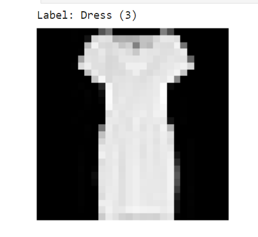

# ImageClassificationUsingConvNetOnFashionDataset
Create a convolution neural network with a maximum of 100k parameters for identifying various fashion images.

## 1. Problem Statement  

Accurate image classification is crucial for various applications, including e-commerce, inventory management, and personalized shopping experiences. Here we are tasked to develop a convolutional neural network (CNN) model to classify images from the fashion-MNIST dataset into their respective clothing categories.

## 2. Gather and Understand the Data

### Data Source: 
We will use the **Fashion-MNIST** dataset. Fashion-MNIST is a dataset of Zalando's article images—consisting of a training set of 60,000 examples and a test set of 10,000 examples. Each example is a **28x28** grayscale image, associated with a label from 10 classes.

### Initial Data Exploration:  
We began by exploring the dataset to understand its structure and characteristics. Each image is 28 pixels in height and 28 pixels in width, for a total of 784 pixels in total. Each pixel has a single pixel-value associated with it, indicating the lightness or darkness of that pixel, with higher numbers meaning darker. This pixel-value is an integer between 0 and 255.
Each training and test example is assigned to one of the following labels:  

| Label | Description   |
|-------|---------------|
| 0     | T-shirt/top   |
| 1     | Trouser       |
| 2     | Pullover      |
| 3     | Dress         |
| 4     | Coat          |
| 5     | Sandal        |
| 6     | Shirt         |
| 7     | Sneaker       |
| 8     | Bag           |
| 9     | Ankle boot    |

## 3. Data Preparation and Cleaning:
### Data Transformation: 

- **RandomVerticalFlip**: This transformation randomly flips images vertically. It's often used to augment the dataset, making the model more robust by considering vertically flipped versions of the same images.  
- **RandomHorizontalFlip**: Similarly, this transformation randomly flips images horizontally. It's another data augmentation technique to increase the diversity of training examples.  
- **ToTensor**: This transformation converts the image data into PyTorch tensors. Deep learning models, especially in PyTorch, require input data in tensor format.  
- **Normalize((0.5,), (0.5,))**: This is a normalization transformation. It subtracts a mean value of 0.5 from each channel and divides by 0.5 to scale the pixel values to be in the range [-1, 1].  

## 4. Exploratory Data Analysis (EDA):

### Data Visualization:  
We shall check couple of the data points in the dataset.

  

  

## 5. Feature Selection and Engineering:

In image classification, the features are the pixels themselves, so feature selection and engineering were not relevant in this context.  
We can see the grid of images below after the preproccessed phase:  

  

## 6. Model Selection and Training:

### Data Split:  
We divided the dataset into training(80%) and validation sets(20%) of the 60,000 images we have downloaded. The test set is kept aside which consists of 10,000 images.  

### Algorithm Selection:  
Implemented a convolutional neural network (CNN) for its effectiveness in image classification tasks and here we
are restricted that the number of parameters shouldn't be more than 100,000.  

    

### Model Training:  
- **Evaluation metric**: Accuracy. 
- **Loss Function**: Categorical Cross Entropy
- **Optimizer**: ADAM

### Cross-Validation:  
We performed cross-validation to assess model performance.

## 7. Model Evaluation

### Fine-Tuning:  
We adjusted hyperparameters like the learning rate, batch size, number of epochs to improve the model performance.  

Model performance graphs are plotted to monitor the CNN model.  

  

   

### Test Set Validation:  
The final model was validated using a separate test set.  
 
## 8. Results  
The sample prediction from our trained model is shown below:  

  

We can see that the actual image is trouser and our model has chosen the label as trouser too.  
From the model setting, constraints and the available dataset, our model has obtained **90.33%** on the unseen test dataset.  

## 9. Further options to increase the test accuracy
**Data augmentation**: Diversifies your training set and leads to better generalization

- Flipping
- Rotation
- Shifting
- Cropping
- Adding noise
- Blurring

**Regularization**: Reduces overfitting on the training set

- Early stopping
- Dropout
- regularization
- Batch normalization

**Hyperparameter tuning**:
- Weight initialization
- Learning rate
- Activation functions
- Optimizers
